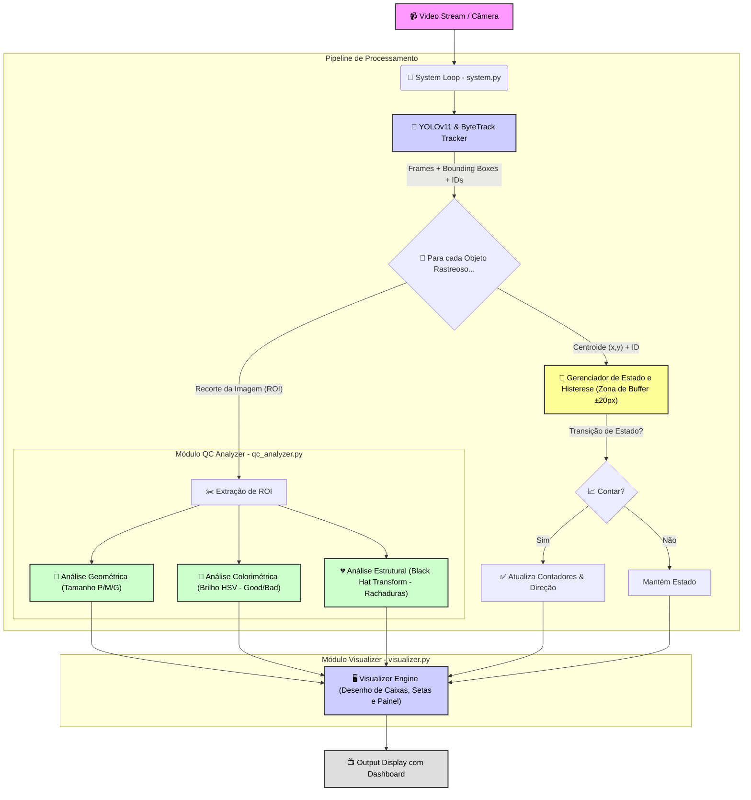

# 📘 Documentação Técnica e Arquitetura

Neste documento, detalho a arquitetura e as decisões técnicas que tomei durante o desenvolvimento do **Coconut Counter & Analyzer**. Meu objetivo foi criar um sistema híbrido que une a robustez do Deep Learning com a precisão da Visão Computacional clássica.

## 1. Pipeline de Processamento

Desenvolvi o sistema para operar em tempo real, processando o vídeo quadro a quadro. A arquitetura que desenhei segue este fluxo:

1.  **Captura:** Leio o frame via OpenCV.
2.  **Inferência (YOLOv11):** Utilizo o modelo que treinei para detectar e rastrear (*Tracking*) os cocos. Escolhi o rastreador `ByteTrack` pela sua persistência em oclusões.
3.  **Extração de ROI:** Recorto a região de interesse de cada objeto detectado para análise individual.
4.  **Módulo de QC (Quality Control):** Envio o recorte para minha classe `QCAnalyzer`, que retorna métricas de cor e integridade.
5.  **Lógica de Contagem:** Verifico o cruzamento de linha utilizando um algoritmo de histerese que criei para evitar contagens falsas.
6.  **Renderização:** O `Visualizer` projeta os dados processados de volta no frame original.

Arquitetura

## 2. Estratégia de Detecção de Rachaduras

Para detectar rachaduras, decidi **não utilizar Deep Learning** (como segmentação por IA), pois exigiria um dataset massivo de cocos rachados que eu não possuía. Em vez disso, implementei uma solução baseada em **Morfologia Matemática**.

### Meu Algoritmo (Black Hat Transform)
No módulo `src/qc_analyzer.py`, apliquei a seguinte lógica:

1.  **Máscara Circular Dinâmica:** Crio uma máscara que remove as bordas da *Bounding Box* para garantir que estou analisando apenas a superfície do coco, ignorando a esteira.
2.  **Suavização (Gaussian Blur):** Aplico um filtro para remover as fibras naturais ("pelos") do coco, que poderiam ser confundidas com rachaduras.
3.  **Transformação Black Hat:** Utilizo esta operação morfológica para subtrair a imagem original do seu "fechamento" (closing).
    * *O resultado:* Esta operação isola perfeitamente elementos **escuros e finos** em um fundo mais claro, destacando as fissuras.
4.  **Análise de Densidade:** Se a área de pixels detectada superar o `CRACK_LIMIT_RATIO` que defini nas configurações, classifico o objeto como *Cracked*.

## 3. Lógica de Contagem Robusta (Anti-Flicker)

Percebi que contar objetos apenas cruzando uma linha (Y) gerava erros quando o objeto "tremia" na detecção. Para resolver isso, implementei uma **Zona de Histerese (Buffer)**.

Defini três estados para cada objeto:
* `ABOVE`: Centroide acima da zona de buffer.
* `BELOW`: Centroide abaixo da zona de buffer.
* `TRANSITION`: Dentro da zona de buffer (Offset ±20px).

**Minha Regra:** Só incremento a contagem quando o objeto realiza uma transição completa de estado (ex: `ABOVE` -> `BELOW`), ignorando qualquer oscilação enquanto ele estiver na zona de `TRANSITION`.

## 4. Métricas de Performance

* **CPM (Cocos Por Minuto):** Para garantir que a métrica seja real mesmo se o processamento do vídeo for lento, calculo o tempo baseando-me no *timestamp* dos frames do vídeo, e não no relógio do sistema.
* **Detecção Automática de Fluxo:** Implementei uma lógica comparativa que monitora `count_up` vs `count_down` em tempo real para determinar automaticamente qual é a direção principal da esteira.